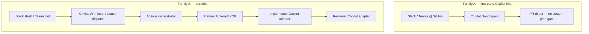

# Research: messaging-app triggers for the agent pipeline

**Date:** 2026-08-04  
**Question:** What first-party options exist to maintainer-gate and invoke this agent pipeline from messaging apps (Slack, Microsoft Teams, and any other well-documented channels), including how they compose with a portable Actions orchestrator + pluggable adapters? Cover triggers, authz (so random workspace members cannot burn spend), hosting/billing, and fit for a public GitHub OSS repo. Primary sources only. Note: prototype acceptance stays label-only; this research informs optional later invoke channels in the spec.  
**Issue context:** [#89](https://github.com/mnaimfaizy/issuebridge/issues/89) (wayfinder research; part of #80 — this note does not map #80).  
**Locked context (#85):** GitHub-hosted Actions orchestrator; planner Actions/BYOK; implementer+reviewer Copilot adapter; portable adapters (Cursor etc. later).

## Scope of this note

Primary sources only:

- GitHub Docs (Copilot cloud agent integrations, Slack/Teams GitHub apps, Actions events/REST, environments, Actions billing)
- Slack Developer Docs (slash commands, request verification)
- Microsoft Learn (Teams bots)

Secondary blogs, Marketplace marketing copy, and third-party “how we wired Slack to Actions” posts are **not** used as evidence. Where a product does not publish a first-party messaging trigger for GitHub, that absence is stated from the published integration list.

---

## Executive verdict

There are **two distinct first-party families**, and they do **not** compose the same way with a portable Actions orchestrator:

| Family | What it invokes | Composes with custom Actions orchestrator? | Authz gate (published) | Public OSS fit |
|--------|-----------------|--------------------------------------------|------------------------|----------------|
| **A. GitHub Copilot cloud agent in Slack / Teams** (also Linear, Jira, Azure Boards) | Copilot directly → PR | **No** — bypasses a custom orchestrator; integrations create a PR directly and do **not** support research/plan-before-PR | Caller must have GitHub **write** on the target repo + paid Copilot | Works on public repos; spend is **Copilot AI credits** (+ Actions for agent env). Authz is “any collaborator with write,” not “maintainer-only” unless write is already scarce |
| **B. Messaging → GitHub API → Actions** (custom Slack slash command / Teams bot calling `repository_dispatch`, `workflow_dispatch`, or issues/labels) | Your Actions workflow | **Yes** — this is the portable-orchestrator path | **You** implement allowlists / environment required reviewers / label permissions | Excellent fit: same public-repo free standard Actions minutes; adapter hosting is separate; prototype can stay **label-only** while this remains optional |

**Prototype note:** keep acceptance **label-only**. Optional later channels should prefer **Family B** (especially “message → apply invoke label / open issue”) so the gate stays on GitHub permissions and the orchestrator stays portable. Family A is a documented alternative for humans who want Copilot-from-chat, but it is **not** an invoke path for the locked Actions + adapter stack.

---

## 1. First-party GitHub messaging integrations (Family A)

### 1.1 Supported Copilot cloud agent integrations

GitHub’s published list of Copilot cloud agent integrations is:

- Microsoft Teams  
- Slack  
- Linear  
- Azure Boards  
- Jira  

Source: [About Copilot integrations](https://docs.github.com/en/copilot/concepts/tools/about-copilot-integrations).

**Discord** is **not** in that list. GitHub’s webhooks docs mention Discord only as an example notification destination for repository events, not as a Copilot agent entry point ([About webhooks](https://docs.github.com/en/webhooks/about-webhooks)).

### 1.2 Slack — Copilot cloud agent

- Delivered as part of the **GitHub App for Slack** ([Integrating Copilot cloud agent with Slack](https://docs.github.com/en/copilot/how-tos/use-copilot-agents/cloud-agent/integrate-cloud-agent-with-slack); install/setup: [Integrating GitHub with Slack](https://docs.github.com/en/integrations/how-tos/slack/integrate-github-with-slack)).
- **Trigger:** `@GitHub` (or `@GitHub Copilot`) in a thread or DM with a natural-language prompt; optional repo/branch in the prompt; channel default repo via `@GitHub settings` (same Slack page).
- **Authz:** “You must have **write** access to the default repository — or the repository specified in your prompt — in order to trigger Copilot cloud agent to work.” Non-write participants may still add thread context. Enterprise-owned repos need the Slack GitHub App installed with repo selection (same page).
- **Preview:** documented as **public preview**, subject to change (same page).
- **Prerequisites:** paid Copilot plan; Slack workspace membership; GitHub App for Slack installed (same page).
- **Security:** Copilot uses the **linked GitHub account’s permissions**; may create PRs/issues; captures the **entire thread** as context stored on the PR (same page).
- **Also:** can create GitHub issues from Slack via Copilot (same page). Separate from agent coding: slash commands like `/github open owner/repo` open issues under the signed-in user’s permissions ([Using GitHub in Slack](https://docs.github.com/en/integrations/how-tos/slack/use-github-in-slack)).

### 1.3 Microsoft Teams — Copilot cloud agent

- Part of the **GitHub integration for Teams** ([Integrating Copilot cloud agent with Teams](https://docs.github.com/en/copilot/how-tos/use-copilot-agents/cloud-agent/integrate-cloud-agent-with-teams); install: [Integrating GitHub with Teams](https://docs.github.com/en/integrations/how-tos/teams/integrate-github-with-teams)).
- **Trigger:** mention `@GitHub` in a thread; optional `repo=` / `branch=` syntax; iteration continues in the same thread (Teams Copilot page).
- **Authz:** only users with **write** on the default or specified repo can trigger agent work; others may contribute thread context (same page).
- **Preview:** **public preview**, subject to change (same page).
- **Prerequisites:** paid Copilot; Teams channel membership (same page). App install once per team; each member connects their GitHub account (same page).
- **Context:** entire thread captured and stored on the PR (same page).

Non-agent Teams commands cover notifications/subscriptions and issue/PR collaboration ([Using GitHub in Teams](https://docs.github.com/en/integrations/how-tos/teams/use-github-in-teams)) — useful for “create issue from chat,” not for running a custom Actions orchestrator by themselves.

### 1.4 Other well-documented Copilot channels (not chat apps)

| Channel | Invoke pattern | Authz (published) | Source |
|---------|----------------|-------------------|--------|
| Linear | Assign / invoke from Linear issue; agent guidance; optional custom agent | Write on target GitHub repo | [Integrate with Linear](https://docs.github.com/en/copilot/how-tos/use-copilot-agents/cloud-agent/integrate-cloud-agent-with-linear) |
| Jira | Assign Copilot, `@GitHub Copilot` comment, or Jira automation “Use GitHub Copilot” | Write on target GitHub repo; Atlassian Forge + GitHub apps required | [Integrate with Jira](https://docs.github.com/en/copilot/how-tos/use-copilot-agents/cloud-agent/integrate-cloud-agent-with-jira) |
| Azure Boards | “Create a pull request with Copilot” on a work item | Paid Copilot; Copilot enabled on connected repos; Azure Boards GitHub App | [Integrate with Azure Boards](https://docs.github.com/en/copilot/how-tos/use-copilot-agents/cloud-agent/integrate-cloud-agent-with-azure-boards) |

### 1.5 Hard composition constraint for Family A

Deep research / plan / iterate **before** opening a PR is **only** available for Copilot cloud agent **on GitHub.com**. Integrations (explicitly including Slack and Teams) **only support creating a pull request directly** ([About GitHub Copilot cloud agent](https://docs.github.com/en/copilot/concepts/agents/cloud-agent/about-cloud-agent)).

Implication for the locked map (Actions orchestrator + human plan-gate + pluggable adapters): **Slack/Teams Copilot invoke does not enter that pipeline.** It is a parallel product path that spends Copilot credits and opens a PR via Copilot’s own Actions-backed environment ([About GitHub Copilot cloud agent](https://docs.github.com/en/copilot/concepts/agents/cloud-agent/about-cloud-agent); usage costs on the same page).

### 1.6 Authz and spend burn (Family A)

- Gate is **repository write**, not maintainer/admin and not Slack/Teams role ([Slack](https://docs.github.com/en/copilot/how-tos/use-copilot-agents/cloud-agent/integrate-cloud-agent-with-slack), [Teams](https://docs.github.com/en/copilot/how-tos/use-copilot-agents/cloud-agent/integrate-cloud-agent-with-teams)).
- On a public OSS repo, anyone granted **write** (or stronger) who connects Slack/Teams can start sessions; random workspace members **without** GitHub write cannot trigger agent writes (same pages).
- Copilot enablement: Pro/Pro+/Max enabled by default; Business/Enterprise need admin policy; repos can be opted out ([Access management](https://docs.github.com/en/copilot/concepts/agents/cloud-agent/access-management)).
- **Automations** (schedule/event auto-start) are **not available in public repositories** ([Access management](https://docs.github.com/en/copilot/concepts/agents/cloud-agent/access-management)) — irrelevant to interactive Slack/Teams invoke, but relevant if someone hoped to auto-chain messaging → Copilot without a human.

**Spend:** cloud agent uses **AI credits** and **Actions minutes**; included Actions minutes for standard hosted runners on **public** repos remain free ([About GitHub Copilot cloud agent](https://docs.github.com/en/copilot/concepts/agents/cloud-agent/about-cloud-agent); [GitHub Actions billing — free use](https://docs.github.com/en/billing/concepts/product-billing/github-actions#free-use-of-github-actions)). The burn risk for a public OSS pilot is therefore primarily **Copilot AI credits**, not Actions minutes.

---

## 2. Portable path: messaging adapters → Actions (Family B)

This is the path that composes with a **GitHub-hosted Actions orchestrator + pluggable adapters**.

### 2.1 Actions entry points usable from outside GitHub

| Event | How messaging would fire it | Notes | Source |
|-------|----------------------------|-------|--------|
| `repository_dispatch` | Custom app `POST /repos/{owner}/{repo}/dispatches` with `event_type` + optional `client_payload` | Designed for “activity that happens outside of GitHub”; workflow must exist on **default branch**; filter with `types:` | [Events — repository_dispatch](https://docs.github.com/en/actions/reference/workflows-and-actions/events-that-trigger-workflows#repository_dispatch); [REST — Create a repository dispatch event](https://docs.github.com/en/rest/repos/repos#create-a-repository-dispatch-event) |
| `workflow_dispatch` | Custom app `POST .../actions/workflows/{id}/dispatches` with `ref` + `inputs` | Manual/API trigger; up to 25 inputs; UI/CLI/API | [Events — workflow_dispatch](https://docs.github.com/en/actions/reference/workflows-and-actions/events-that-trigger-workflows#workflow_dispatch); [REST — Create a workflow dispatch event](https://docs.github.com/en/rest/actions/workflows#create-a-workflow-dispatch-event); [Manually run a workflow](https://docs.github.com/en/actions/how-tos/manage-workflow-runs/manually-run-a-workflow) |
| `issues` / `labeled` | Messaging creates an issue or adds a label (official Slack/Teams GitHub apps, or custom bot via Issues API) | Aligns with **label-only prototype acceptance** | [Events — issues](https://docs.github.com/en/actions/reference/workflows-and-actions/events-that-trigger-workflows#issues) |

**Token permissions (primary):**

- Classic PAT / OAuth for `repository_dispatch`: **`repo` scope** ([Create a repository dispatch event](https://docs.github.com/en/rest/repos/repos#create-a-repository-dispatch-event)).
- Fine-grained PAT: `POST /repos/{owner}/{repo}/dispatches` requires **Contents: write** ([Permissions for fine-grained PATs — Contents](https://docs.github.com/en/rest/authentication/permissions-required-for-fine-grained-personal-access-tokens)).
- Fine-grained PAT: `POST .../workflows/{workflow_id}/dispatches` requires **Actions: write** ([same permissions doc — Actions](https://docs.github.com/en/rest/authentication/permissions-required-for-fine-grained-personal-access-tokens)).
- Classic PAT for workflow dispatch: **`repo` scope** ([Create a workflow dispatch event](https://docs.github.com/en/rest/actions/workflows#create-a-workflow-dispatch-event)).

Prefer a **GitHub App** or fine-grained token scoped to one public repo over a classic `repo` PAT for an OSS maintainer bot.

`client_payload` limits: ≤10 top-level properties, &lt;64KB total ([Create a repository dispatch event](https://docs.github.com/en/rest/repos/repos#create-a-repository-dispatch-event)).

### 2.2 Slack as a custom invoke adapter (first-party Slack platform)

**Slash commands** ([Implementing slash commands](https://docs.slack.dev/interactivity/implementing-slash-commands/)):

- User types `/command text` → Slack HTTP POSTs a form payload to your **Request URL** (HTTPS required for distributed apps).
- Payload includes `user_id`, `team_id`, `channel_id`, `command`, `text`, `response_url`, `trigger_id` — enough to **allowlist maintainers by Slack `user_id`** before calling GitHub.
- Must acknowledge within **3 seconds**; longer work via `response_url`.
- Slash commands **cannot** be invoked inside message threads (same page) — use Events API / app mentions if thread UX matters.
- Always verify signatures ([Verifying requests from Slack](https://docs.slack.dev/authentication/verifying-requests-from-slack/)): HMAC of `v0:timestamp:body` with signing secret; reject skew &gt;5 minutes.

**Hosting:** Slack does not run your command logic; you host the Request URL (or use Socket Mode via Bolt to avoid a public URL — Bolt documents Socket Mode skipping HTTP signature middleware because the socket path differs: [Bolt request verification](https://docs.slack.dev/tools/bolt-python/reference/middleware/request_verification/request_verification.html)). Billing for the adapter is your host’s cost, not Slack’s published “per invoke” fee in these docs.

**Composition pattern (recommended for optional later channels):**

```text
Slack slash / mention
  → verify Slack signature
  → allowlist Slack user_id (maintainer map)
  → GitHub: add label / open issue / repository_dispatch
  → Actions orchestrator (same as label-gated prototype)
  → planner / implementer / reviewer adapters
```

Using **label or issue** as the GitHub-side trigger keeps prototype acceptance unchanged and reuses the same authz story (“who can label”).

### 2.3 Microsoft Teams as a custom invoke adapter

Microsoft documents **Teams bots** that receive user messages/commands and run activity handlers ([Bot overview](https://learn.microsoft.com/en-us/microsoftteams/platform/bots/what-are-bots)). Capabilities include conversational bots, notification bots, workflow bots, and **command bots** (Agents Toolkit templates with Adaptive Cards) on the same page.

**Authz pattern:** identify the Teams user in the activity, map to an allowlisted maintainer, then call GitHub APIs as in §2.1. Incoming webhooks alone are oriented to **posting into** Teams, not to authenticated command invoke ([Incoming webhooks](https://learn.microsoft.com/en-us/microsoftteams/platform/webhooks-and-connectors/how-to/add-incoming-webhook)) — use a bot (or Workflows with careful auth) for maintainer-gated commands.

**Hosting:** bot registration / Azure (or equivalent) hosting is outside GitHub; same “adapter hosts elsewhere, orchestrator stays on Actions” split as Slack.

### 2.4 Extra Actions-side gates (maintainer spend control)

Even if a messaging adapter is compromised or over-broad:

- **Environments + required reviewers:** a job with `environment:` waits for approval by up to six users/teams; optional prevent self-review. Available for **public** repositories on current GitHub plans ([Trigger a workflow — environments](https://docs.github.com/en/actions/how-tos/write-workflows/choose-when-workflows-run/trigger-a-workflow); [Deployments and environments](https://docs.github.com/en/actions/reference/workflows-and-actions/deployments-and-environments); [Manage environments](https://docs.github.com/en/actions/how-tos/deploy/configure-and-manage-deployments/manage-environments)).
- **Workflow `if:`** on `github.actor`, payload fields, or label name.
- **Do not** put long-lived classic PATs in the Slack/Teams workspace; store secrets on the adapter host or as GitHub App credentials.

Anyone with **write** can run Actions that are triggerable; costs bill the **repository owner** ([GitHub Actions billing](https://docs.github.com/en/billing/concepts/product-billing/github-actions)). On a **public** repo, standard GitHub-hosted runner minutes are **free**; larger runners are always charged (same page). For the locked public OSS pilot, Actions minute burn from a messaging adapter is therefore low risk on standard runners; **planner BYOK / Copilot adapter AI credits** remain the spend to gate.

---

## 3. How this maps to the locked stack (#85)



| Requirement from locked context | Family A (Slack/Teams Copilot) | Family B (custom messaging → Actions) |
|---------------------------------|--------------------------------|----------------------------------------|
| GitHub-hosted Actions orchestrator | Copilot’s own ephemeral Actions env only | Yes — your workflows |
| Planner Actions/BYOK | Not available on integrations (PR-direct) | Yes |
| Implementer+reviewer Copilot adapter | Entire loop is Copilot product | Adapter steps remain yours |
| Portable later adapters (Cursor etc.) | No | Yes — swap adapter jobs |
| Maintainer-only gate | Write-collaborator gate only | Slack/Teams allowlist + GitHub perms + optional environment reviewers |
| Prototype label-only acceptance | Parallel product; do not count as orchestrator invoke | Prefer label/issue bridge; dispatch as later alternative |

---

## 4. Hosting and billing summary (public OSS)

| Component | Hosting | Billing notes (primary) |
|-----------|---------|-------------------------|
| Official GitHub↔Slack / GitHub↔Teams apps | GitHub-operated | No separate “Actions orchestrator” cost; Copilot sessions consume AI credits; public standard Actions minutes free |
| Custom Slack/Teams adapter | Operator-hosted HTTPS or Socket Mode / Teams bot host | Operator infra cost; GitHub token must be protected |
| Actions orchestrator on public repo | GitHub-hosted runners | Standard runners **free** for public repos ([Actions billing](https://docs.github.com/en/billing/concepts/product-billing/github-actions#free-use-of-github-actions)) |
| Copilot implementer/reviewer adapter | GitHub Copilot product | AI credits per plan; see related research on Copilot cost (#82 note) |

---

## 5. Fit for a public GitHub OSS repo — recommendations for the spec

1. **Do not treat Slack/Teams Copilot as an invoke channel for the portable pipeline.** Document it as an optional human convenience that bypasses plan-gate and adapters ([About Copilot cloud agent](https://docs.github.com/en/copilot/concepts/agents/cloud-agent/about-cloud-agent)).
2. **Keep prototype acceptance label-only.** Optional later messaging should bridge into the **same label (or issue) event**, so authz stays “who can label on GitHub,” which is already tighter than “who is in the Slack channel.”
3. If a direct chat command is desired later, implement **Family B**: verify Slack/Teams requests, allowlist maintainers, then `repository_dispatch` / `workflow_dispatch` / Issues API — and optionally put spend-heavy jobs behind an **environment with required reviewers** ([Environments](https://docs.github.com/en/actions/reference/workflows-and-actions/deployments-and-environments)).
4. **Write-collaborator Copilot-from-chat** is enough to burn AI credits; for a public learning budget, either keep write scarce, disable cloud agent on the repo ([Access management](https://docs.github.com/en/copilot/concepts/agents/cloud-agent/access-management)), or rely on the Actions orchestrator path only.
5. **Discord / other chat:** no first-party Copilot agent integration in GitHub’s published list ([About Copilot integrations](https://docs.github.com/en/copilot/concepts/tools/about-copilot-integrations)); any Discord invoke would be custom Family B (bot → GitHub API), out of “first-party messaging product” scope.

---

## 6. Sources (primary)

- [About Copilot integrations](https://docs.github.com/en/copilot/concepts/tools/about-copilot-integrations)
- [Integrating Copilot cloud agent with Slack](https://docs.github.com/en/copilot/how-tos/use-copilot-agents/cloud-agent/integrate-cloud-agent-with-slack)
- [Integrating Copilot cloud agent with Teams](https://docs.github.com/en/copilot/how-tos/use-copilot-agents/cloud-agent/integrate-cloud-agent-with-teams)
- [Integrating Copilot cloud agent with Linear](https://docs.github.com/en/copilot/how-tos/use-copilot-agents/cloud-agent/integrate-cloud-agent-with-linear)
- [Integrating Copilot cloud agent with Jira](https://docs.github.com/en/copilot/how-tos/use-copilot-agents/cloud-agent/integrate-cloud-agent-with-jira)
- [Integrating Copilot cloud agent with Azure Boards](https://docs.github.com/en/copilot/how-tos/use-copilot-agents/cloud-agent/integrate-cloud-agent-with-azure-boards)
- [About GitHub Copilot cloud agent](https://docs.github.com/en/copilot/concepts/agents/cloud-agent/about-cloud-agent)
- [Managing access to GitHub Copilot cloud agent](https://docs.github.com/en/copilot/concepts/agents/cloud-agent/access-management)
- [Integrating GitHub with Slack](https://docs.github.com/en/integrations/how-tos/slack/integrate-github-with-slack)
- [Using GitHub in Slack](https://docs.github.com/en/integrations/how-tos/slack/use-github-in-slack)
- [Integrating GitHub with Teams](https://docs.github.com/en/integrations/how-tos/teams/integrate-github-with-teams)
- [Using GitHub in Teams](https://docs.github.com/en/integrations/how-tos/teams/use-github-in-teams)
- [Events that trigger workflows](https://docs.github.com/en/actions/reference/workflows-and-actions/events-that-trigger-workflows)
- [Create a repository dispatch event](https://docs.github.com/en/rest/repos/repos#create-a-repository-dispatch-event)
- [Create a workflow dispatch event](https://docs.github.com/en/rest/actions/workflows#create-a-workflow-dispatch-event)
- [Manually running a workflow](https://docs.github.com/en/actions/how-tos/manage-workflow-runs/manually-run-a-workflow)
- [Permissions required for fine-grained personal access tokens](https://docs.github.com/en/rest/authentication/permissions-required-for-fine-grained-personal-access-tokens)
- [Trigger a workflow (environments)](https://docs.github.com/en/actions/how-tos/write-workflows/choose-when-workflows-run/trigger-a-workflow)
- [Deployments and environments](https://docs.github.com/en/actions/reference/workflows-and-actions/deployments-and-environments)
- [GitHub Actions billing](https://docs.github.com/en/billing/concepts/product-billing/github-actions)
- [Implementing slash commands (Slack)](https://docs.slack.dev/interactivity/implementing-slash-commands/)
- [Verifying requests from Slack](https://docs.slack.dev/authentication/verifying-requests-from-slack/)
- [Teams bot overview](https://learn.microsoft.com/en-us/microsoftteams/platform/bots/what-are-bots)
- [About webhooks](https://docs.github.com/en/webhooks/about-webhooks) (Discord mentioned only as notification example)
